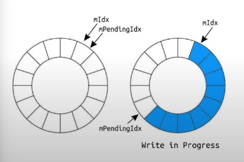

# ⚡️ Single Producer, Multiple Consumer Queue (Ring Buffer)

Inspired by a talk at CPPCon 2022: [Trading at Light Speed](https://youtu.be/8uAW5FQtcvE), I wanted to create my own version of a single producer, multiple consumer ring buffer (SPMC queue). This type of queue allows for multicast message fanning.

In this case, multicast message fanning refers to multiple threads accessing the same messages produced by a single producer. Obviously, concurrency management and synchronization are the design factors of such a queue.

One way to approach the problem is to simply use locks and mutexes, but the overhead is too high. The latency when using locks is not good. I am not an expert on locks, but I will state a few reasons why locks and mutexes are slow:
1. Context switching is costly when acquiring a lock.
2. Waiting to acquire a lock increases contention and decreases performance.
3. Locks are not cache friendly at all because one thread might invalidate the cache line of another lock.

## 1️⃣ SPMC Version 1
As David Gross explains in the talk *Trading at Light Speed*, atomic operations are the way to go for a lock-free design. In version 1 of the lock-free queue, David Gross proposes having 2 atomic indices that are globally shared within the queue structure to synchronize reading and writing.


However, there is still a way to create a much faster version of this lock-free queue. In version 1, when the synchronization indices are in a global scope, all threads update the same global variables. This leads to high contention and bottlenecks as threads compete to update the same shared resource.

## 2️⃣ SPMC Version 2 ✅
How about having each element of a queue have its own version number? Well, as shown in the implementation in this code, doing this change brings a NICE performance boost.
Why?
1. Reduced Contention: If the atomic synchronization indices are in the local scope of each queue's element, the competition between different threads is reduced. Different threads can work on different blocks concurrently!
2. Better Cache Utilization: Each thread updates a version number that is close to the data it is working on, so there are fewer cache misses and better cache locality. Each block's (queue element) metadata and data are likely to be cached together.

```cpp
struct Block
{
    // Local block versions reduce contention for the queue
    std::atomic<BlockVersion> mVersion;
    // Size of the data
    std::atomic<MessageSize> mSize;
    // 64 byte buffer
    alignas(64) uint8_t mData[64];
};
```

###  How does synchronization work?
1. Initially, all the block's versions are set to 0: no reads allowed.
2. When writing:
   1. If it is the first write, just write the data, and after the write is complete, increment the version to 1. The odd version means a read is allowed.
   2. If it is a rewrite, then the version is already odd, so before writing, increment the version so it is even (no reads allowed). Perform the write. Once writing is done, increment the version again to make it odd (reading is allowed).
3. When reading:
   1. Check the version, and if it is odd, perform the read.
   2. Increment the version by 2 (read by other threads allowed for the same block).

**Note:** This design can be slightly modified to make the queue load balance messages instead of multicasting.

## 🔢 Performance Test
The SPMC Queue in `spmc_q.h` was tested for the number of messages processed by the consumers over 5 seconds with a blocking queue using mutexes and locks, and the `boost::lockfree::queue`.
This is not totally a fair comparison as the blocking queue and the `boost::lockfree::queue` are not multicast.


From the histogram above, you can see the SPMC Queue completely overtakes the other 2 queues.
**Note:** The numbers should be looked at relatively compared to the other queues as the specific performance is system and compiler dependent.

## 📝 Code
The code for SPMC Queue and all the benchmarking done is available in the `src` folder.
